# Final homework

- Task 1 - Existing App Analysis 'PocketShop'

PocketShop is a React Native shopping application that allows users to browse products, manage a cart, and place orders. The app includes product listing screens, cart functionality, quantity management, and theme support.

Main User Scenarios:

- Browsing available products
- Adding and removing items from the cart
- Changing product quantity
- Viewing order summary and total price
- Switching between light and dark themes

Areas for Improvement:

-Favorites (Saved Products): Add functionality for users to save and manage favorite products for quick access later.

- Multi-Vendor Product Placement: Allow different users or sellers to publish and manage their own products inside the application. This would transform PocketShop into a marketplace-style platform with multiple vendors.
- In-App Payment System: Integrate secure online payment methods so users can complete purchases directly inside the application without external services.
- User Registration and Authentication: Implement user accounts with registration, login, and authentication features to personalize the experience and protect user data.
- Delivery Tracking: Add shipment and delivery tracking functionality so users can monitor the status and location of their orders in real time.

- Task 2 and 3 - Functionality Extension and UX/UI Improvements

Added functionality: Favorites feature

The application now includes a fully functional Favorites system. Users can mark products as favorites by tapping the heart icon on a product card. Selected items are stored in the global Redux state and displayed in the Favorites section on the Home screen.

The Favorites feature allows users to:

Add products to favorites with a single tap
Remove products from favorites by toggling the same button
View all saved favorite products in a separate list
See an empty state message when no favorites are selected

The UI also reflects the current favorite status of each product, providing immediate visual feedback when an item is added or removed from favorites.

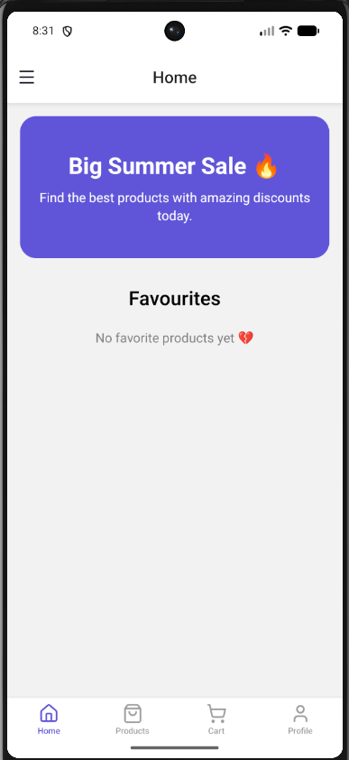
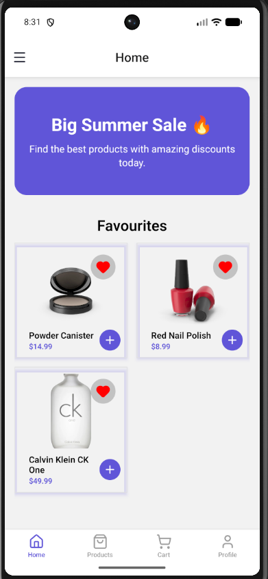

- Task 4 - Documentation

Now the application consists of three main screens:

🏠 Home Screen
The Home screen contains a promotional banner and a Favorites section.
Users can quickly view their saved products and see an empty state when no favorites are selected.
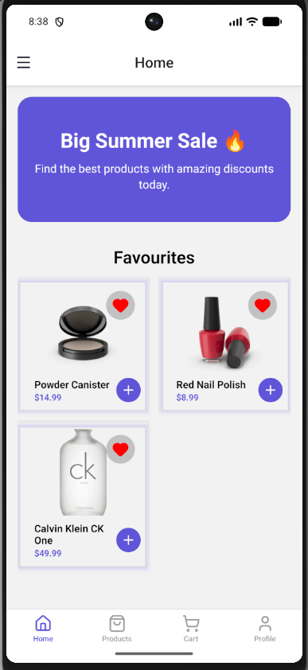

🛍 Products Screen
The Products screen displays a list of products fetched from an external API.
Users can browse items in a 2-column grid layout, search for specific products, and add them to the cart or favorites.
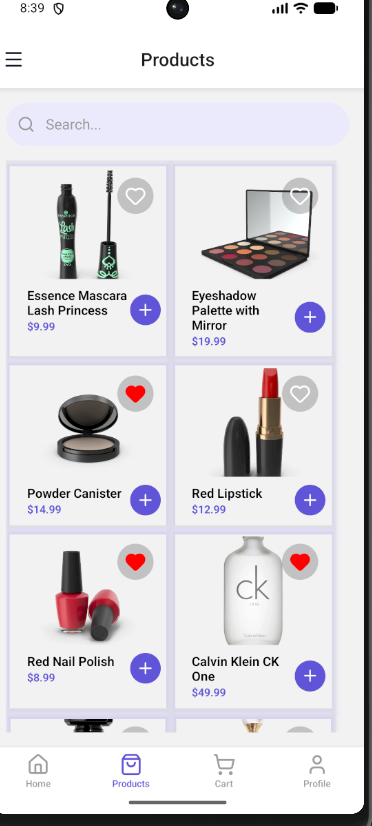

🛒 Cart Screen
The Cart screen allows users to manage selected products.
Users can:
-increase or decrease product quantity
-remove items from the cart
-view the total price of selected items
-proceed with placing an order
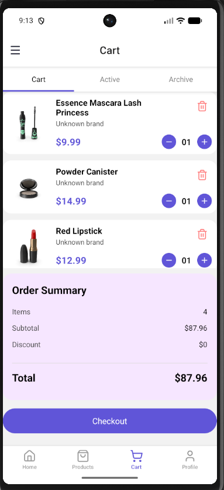
Also the client can see the archive with orders, received from API.

- 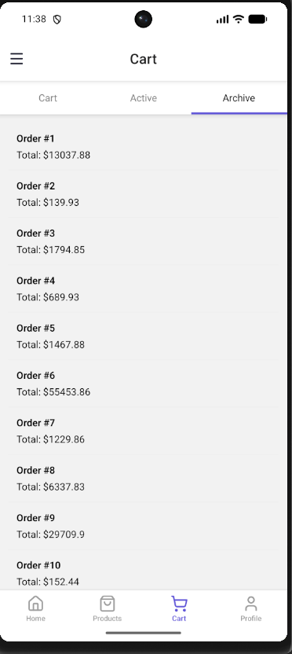

Summary
The application provides a simple e-commerce experience with product browsing, favorites management, and cart functionality, ensuring a smooth and intuitive user experience.

=======================================================

# Homework 6

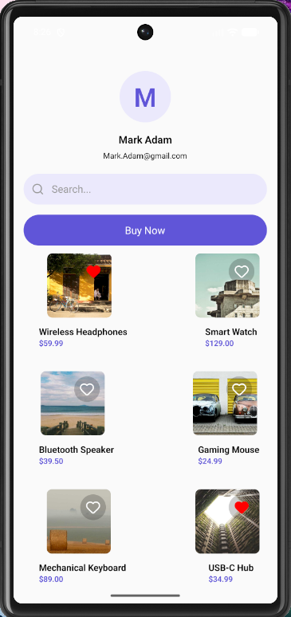

# Homework 7

- 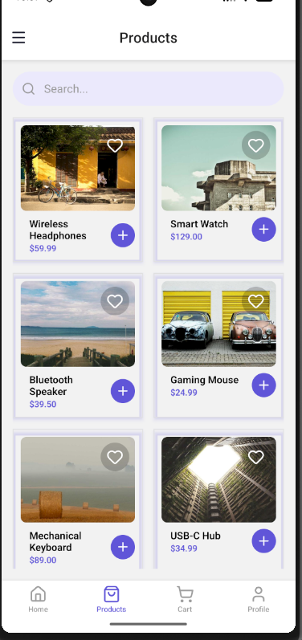
- 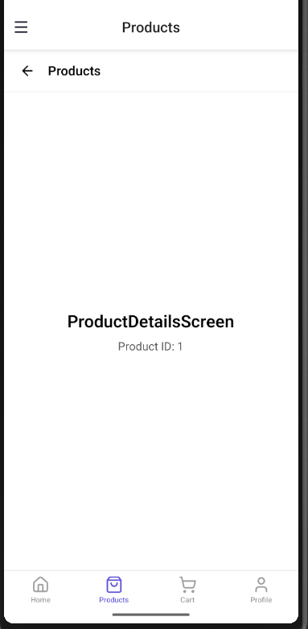
- 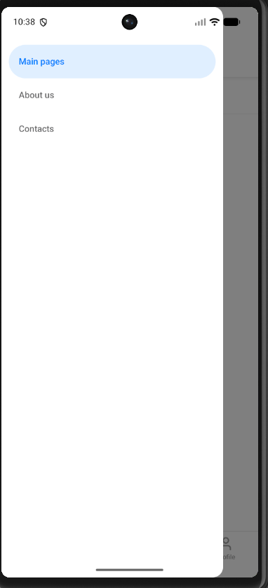

# Homework 8

- 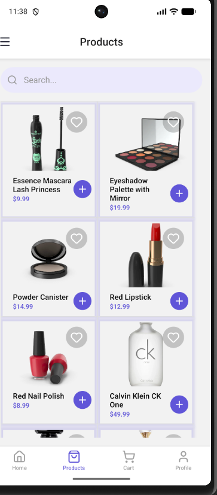
- 

# Homework 9

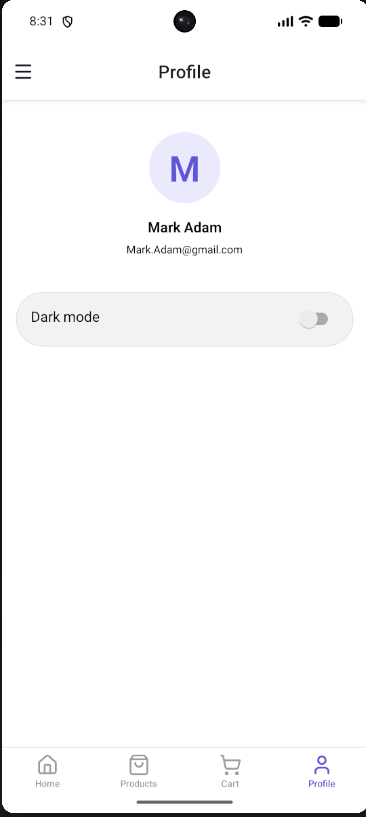
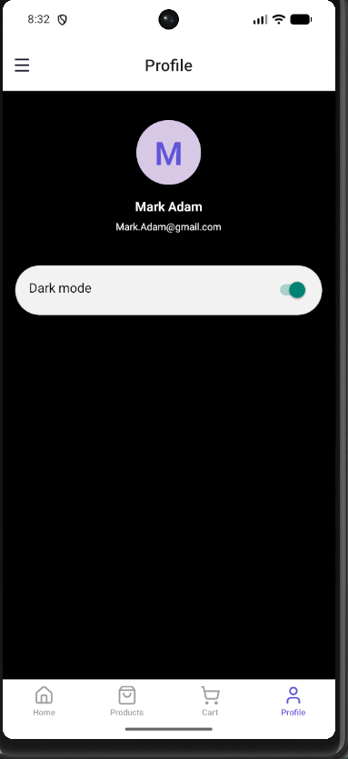
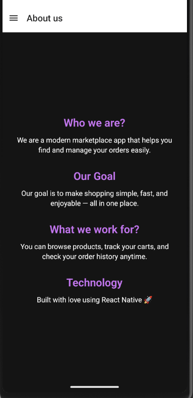
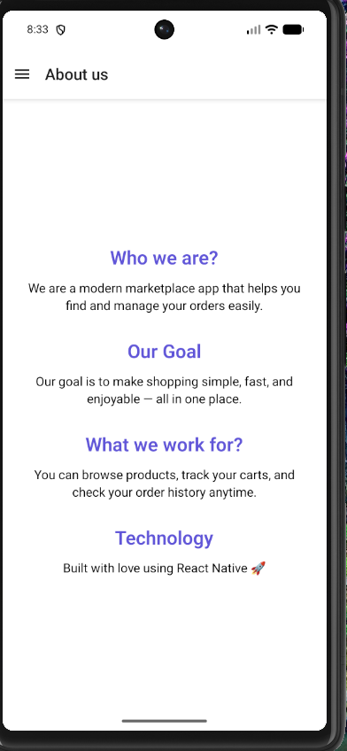


# Homework 11

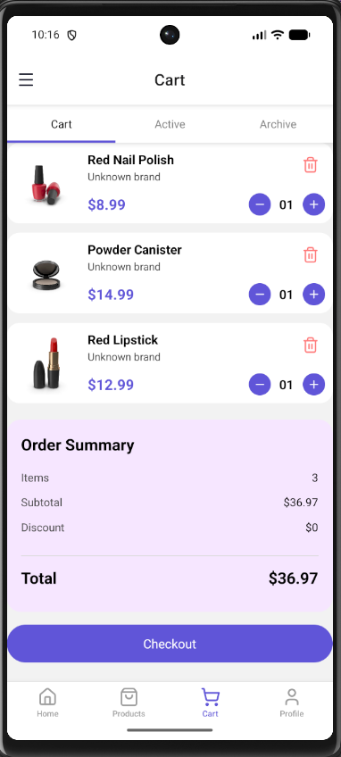
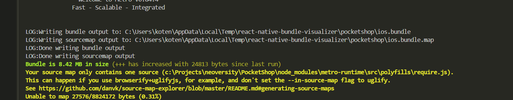

=======================================================

This is a new [**React Native**](https://reactnative.dev) project, bootstrapped using [`@react-native-community/cli`](https://github.com/react-native-community/cli).

# Getting Started

> **Note**: Make sure you have completed the [Set Up Your Environment](https://reactnative.dev/docs/set-up-your-environment) guide before proceeding.

## Step 1: Start Metro

First, you will need to run **Metro**, the JavaScript build tool for React Native.

To start the Metro dev server, run the following command from the root of your React Native project:

```sh
# Using npm
npm start

# OR using Yarn
yarn start
```

## Step 2: Build and run your app

With Metro running, open a new terminal window/pane from the root of your React Native project, and use one of the following commands to build and run your Android or iOS app:

### Android

```sh
# Using npm
npm run android

# OR using Yarn
yarn android
```

### iOS

For iOS, remember to install CocoaPods dependencies (this only needs to be run on first clone or after updating native deps).

The first time you create a new project, run the Ruby bundler to install CocoaPods itself:

```sh
bundle install
```

Then, and every time you update your native dependencies, run:

```sh
bundle exec pod install
```

For more information, please visit [CocoaPods Getting Started guide](https://guides.cocoapods.org/using/getting-started.html).

```sh
# Using npm
npm run ios

# OR using Yarn
yarn ios
```

If everything is set up correctly, you should see your new app running in the Android Emulator, iOS Simulator, or your connected device.

This is one way to run your app — you can also build it directly from Android Studio or Xcode.

## Step 3: Modify your app

Now that you have successfully run the app, let's make changes!

Open `App.tsx` in your text editor of choice and make some changes. When you save, your app will automatically update and reflect these changes — this is powered by [Fast Refresh](https://reactnative.dev/docs/fast-refresh).

When you want to forcefully reload, for example to reset the state of your app, you can perform a full reload:

- **Android**: Press the <kbd>R</kbd> key twice or select **"Reload"** from the **Dev Menu**, accessed via <kbd>Ctrl</kbd> + <kbd>M</kbd> (Windows/Linux) or <kbd>Cmd ⌘</kbd> + <kbd>M</kbd> (macOS).
- **iOS**: Press <kbd>R</kbd> in iOS Simulator.

## Congratulations! :tada:

You've successfully run and modified your React Native App. :partying_face:

### Now what?

- If you want to add this new React Native code to an existing application, check out the [Integration guide](https://reactnative.dev/docs/integration-with-existing-apps).
- If you're curious to learn more about React Native, check out the [docs](https://reactnative.dev/docs/getting-started).

# Troubleshooting

If you're having issues getting the above steps to work, see the [Troubleshooting](https://reactnative.dev/docs/troubleshooting) page.

# Learn More

To learn more about React Native, take a look at the following resources:

- [React Native Website](https://reactnative.dev) - learn more about React Native.
- [Getting Started](https://reactnative.dev/docs/environment-setup) - an **overview** of React Native and how setup your environment.
- [Learn the Basics](https://reactnative.dev/docs/getting-started) - a **guided tour** of the React Native **basics**.
- [Blog](https://reactnative.dev/blog) - read the latest official React Native **Blog** posts.
- [`@facebook/react-native`](https://github.com/facebook/react-native) - the Open Source; GitHub **repository** for React Native.
